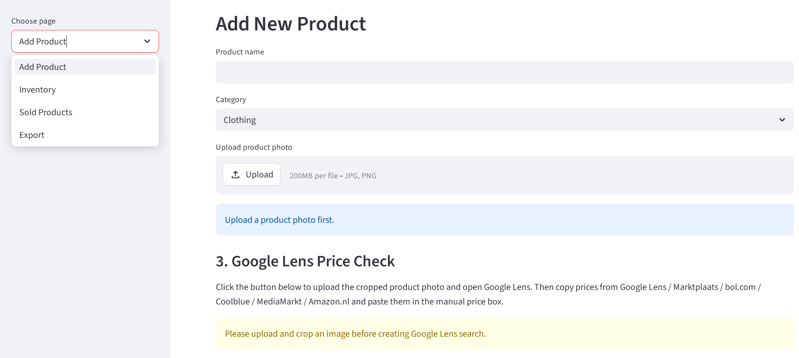
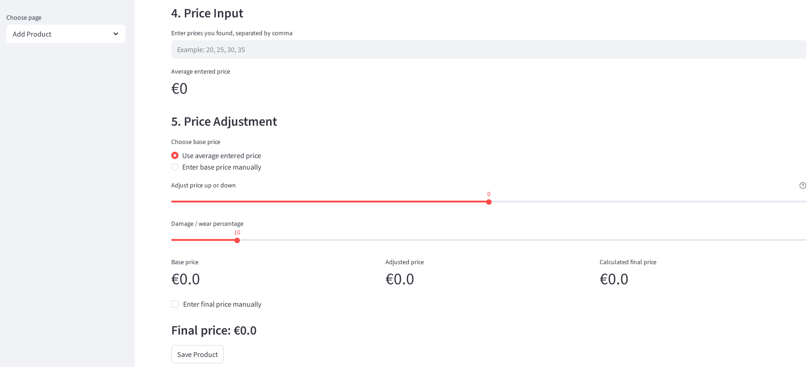

# Kringloop ERP Demo
This is a Demo of a Kringloop Pricing System which is a smart inventory and pricing platform developed for second-hand product management. The system helps users register products, upload product images, analyze market prices, estimate resale values, and manage inventory efficiently.
The project combines image-based product handling with pricing analysis workflows to support sustainable retail and second-hand store operations. 

### Project Overview

The Kringloop ERP Demo is a Python-based application designed to help second-hand stores manage products and estimate fair resale prices using image-assisted workflows and market price analysis.

The system allows users to:

Register products
Upload and crop product images
Remove image backgrounds
Compare market prices using Google Lens
Calculate resale prices automatically
Manage inventory and sold products
Export product data to Excel and PDF

The project supports sustainable retail operations by improving pricing consistency and reducing manual work.

### Screenshots
Product Registration & Inventory

Pricing & Market Analysis

### ✨Features
📦 Product Management
          Add second-hand products
          Category selection
          Inventory tracking
          Sold product management
📸 Image Processing
          Product image upload
          Image cropping
          Automatic background removal
          QR code label generation
📊 Price Analysis
          Google Lens assisted price checking
          Manual market price input
          Average price calculation
          Damage/wear adjustment
          Final resale price estimation
📁 Export Functionality
          Excel export
          PDF export
🛠️ Technologies Used
          Python
          Streamlit
          SQLite
          Pillow (PIL)
          Rembg
          QRCode
          HTML/CSS (Streamlit UI rendering)
          Data-driven Pricing Logic

# 🚀Quick Start

### Install Requirements
pip install -r requirements.txt

### Run the Application
python app.py

Then open: http://127.0.0.1:5000

### 🎯Project Goal

The goal of this project is to support sustainable retail operations by improving the efficiency of pricing second-hand products.

The system reduces manual effort, improves pricing consistency, and helps users make informed pricing decisions using market-based data and product condition analysis.

Future Improvements
AI-based image recognition
Automatic product category detection
Online marketplace integration
Advanced analytics dashboard
Cloud database integration
Multi-user authentication

## 💡 Final Note

Thank you for checking out the Kringloop ERP Demo project.  
I hope you enjoy exploring the system and its features. ♻️✨
Feel free to contribute, improve, or use it as inspiration for your own projects.
